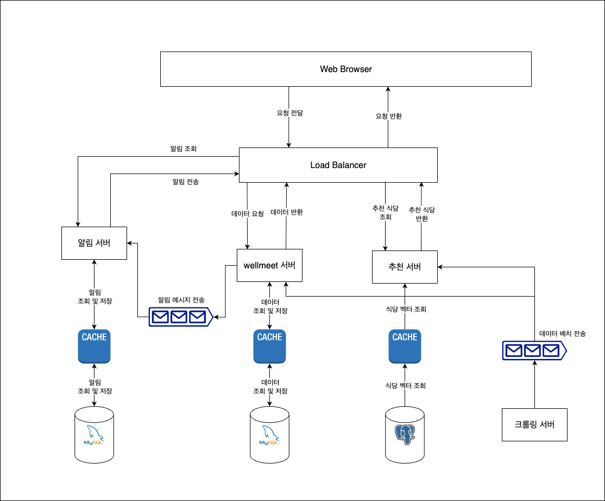
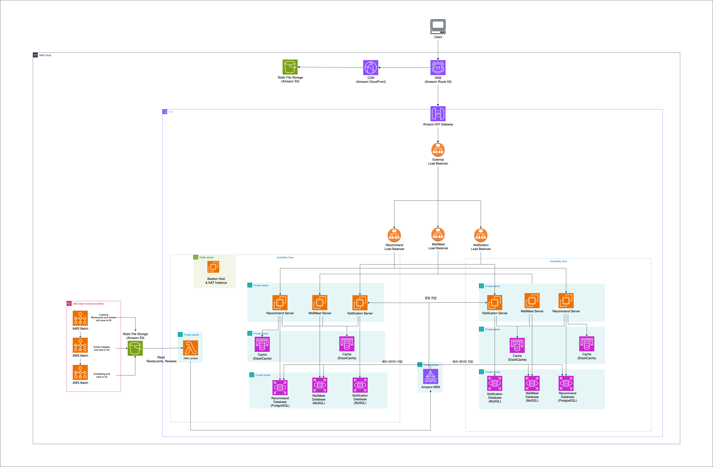
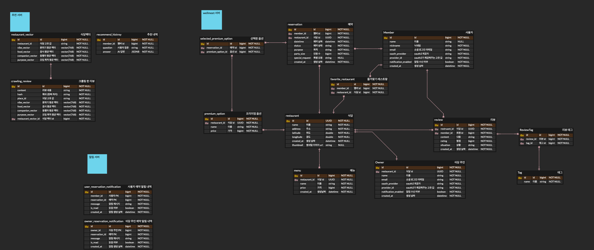

# WellMeet Backend API Server

## 목차

- [1. 프로젝트 개요](#1-프로젝트-개요)
    - [1-1. 프로젝트 소개](#1-1-프로젝트-소개)
    - [1-2. 시스템 구성도](#1-2-시스템-구성도)
    - [1-3. 주요 기능](#1-3-주요-기능)
    - [1-4. 개발 환경](#1-4-개발-환경)
- [2. 개발 결과물](#2-개발-결과물)
    - [2-1. 백엔드 아키텍처](#2-1-백엔드-아키텍처)
    - [2-2. AWS 아키텍처](#2-2-aws-아키텍처)
    - [2-3. 데이터베이스 ERD 및 RDB 구조](#2-3-데이터베이스-erd-및-rdb-구조)

## 1. 프로젝트 개요

### 1-1. 프로젝트 소개

**"귀한 손님을 위한 완벽한 한 끼, AI가 찾아드립니다"**

특별한 손님과의 소중한 시간을 위해 AI가 상황별 최적의 맛집을 추천하고, 예약부터 특별 서비스까지 원스톱으로 제공하는 프리미엄 다이닝 플랫폼입니다.

### 1-2. 시스템 구성도

### 1-3. 주요 기능

### 1-4. 개발 환경

- Front-end: `TypeScript`, `React.js`
- Back-end: `Java`, `Spring Boot`, `JPA`, `MySQL`, `PostgreSQL`, `AWS`

## 2. 개발 결과물

### 2-1. 백엔드 아키텍처

**Reference**:
[백엔드 아키텍처 Ver.0](https://unifolio0.notion.site/Backend-Architecture-235c9077da24809cb0d1eae8868d6187?source=copy_link)

### 2-2. AWS 아키텍처

**Reference**:
[AWS 아키텍처 Ver.0](https://unifolio0.notion.site/AWS-Architecture-235c9077da2480648b0cd3081b3bb9b8?source=copy_link)

### 2-3. 데이터베이스 ERD 및 RDB 구조

**Reference**:
[Erd Diagram Ver.0](https://unifolio0.notion.site/Erd-Diagram-23ac9077da24804099a6d8d2331ad610?source=copy_link)

